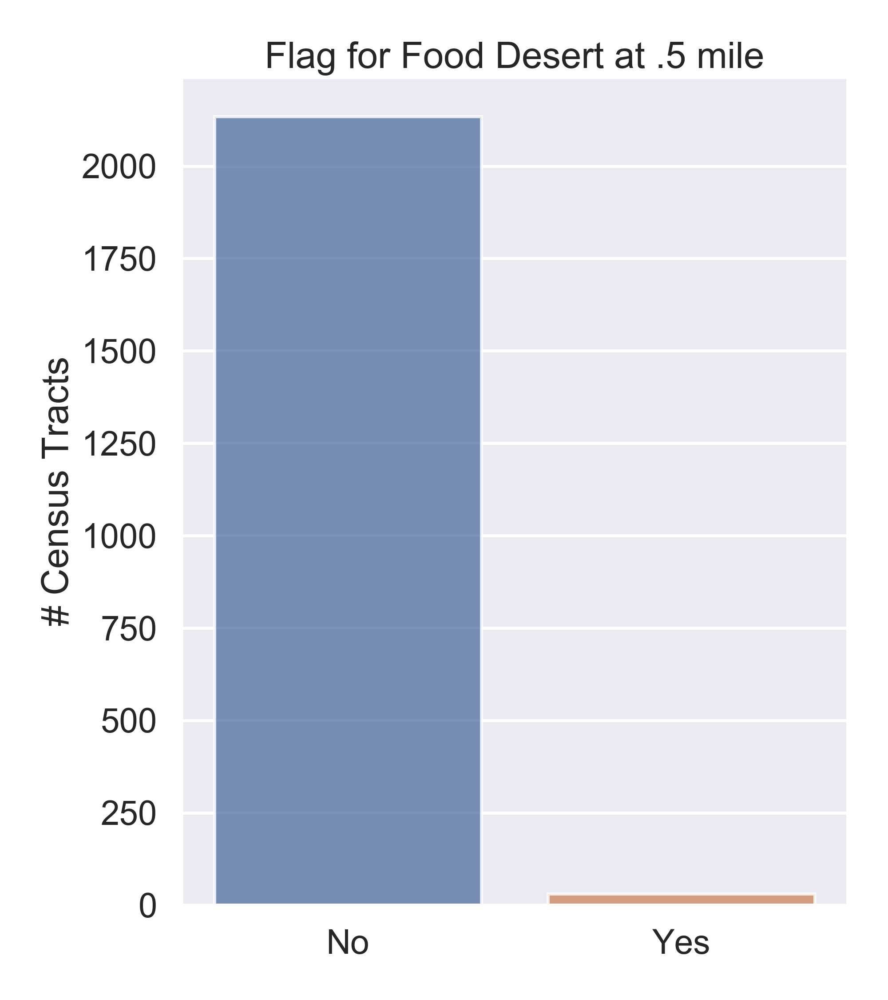

# NYC Food Desert Predictor
## Flatiron Capstone Project by Justin Morgan Williams
### December 2020

## In Progress 12/7/2020 - 1/6/2021

## Overview

Food deserts are geographic areas where constituents have limited access to fresh, healthy and affordable foods. Typically, low-income populations face greater barriers in accessing healthy and affordable retailers, which can lead to food insecurity and higher disease rates. Crisis such as the COVID-19 pandemic can exacerbate these issues. A key finding in September 2020 report entitled [New York Food 20/20](https://static1.squarespace.com/static/572d0fcc2b8dde9e10ab59d4/t/5f7b27b9e0c3e05f19c5442f/1601906624464/ny2020-finalv2.pdf) was, despite the public's increased food standards and awakening to the threats of diet-related diseases, the pandemic bought forth longstanding tensions between the City's actions to ensure NYC residents have both _enough_, and the _right_ foods to eat. Therefore, emphasizing the salient nature of food desert's and the implications for those living within its boundaries. The data utilized comes from a [United States Department of Agriculture (USDA) & Economic Research Service (ERS)](https://www.ers.usda.gov/data-products/food-access-research-atlas/) 2017 study, identifying food deserts nationally at the Census Tract (CT) level. Methods applied include sub-setting NYC, exploratory data analysis (EDA) both geospatial and otherwise, and finally developing a model to predict food deserts for low-income low-access CT's within 1/2 a mile of supermarkets. Results found that more vulnerable populations include **low-income, low-access populations with increased poverty, higher proportion of kids (0-17) and no vehicle**. Recommendations and next steps include looking into incentives for supermarket expansion within the affected CT, perhaps through an already established program such as [Food Retail Expansion to Support Health (FRESH)](https://edc.nyc/program/food-retail-expansion-support-health-fresh). As well as spearheading local community urban agriculture initiatives with youth involvement such as [Red Hook Farms](http://www.added-value.org/).

## Business Case

Identification of food deserts at the CT level in NYC is imperative to the improvement of food policy. Improved food policy could end food insecurity and encourage afflicted populations to chose diets rich in fresh and healthy foods. This could limit diseases of modernity thus reducing the strain on the healthcare industry which would in turn make our city more resilient to crisis such as the COVID-19 pandemic. 

## Data

The data used for this project came mostly from the USDA ERS _Food Research Atlas_ study. Additional 2010 CT geospatial data was obtained from [NYC OpenData](https://data.cityofnewyork.us/City-Government/2010-Census-Tracts/fxpq-c8ku) and merged with the USDA dataset to perform various geospatial visuals. 

USDA dataset included multiple _flag for food desert_ binary columns. This study was solely focused on low-access 1/2 mile from supermarkets, subsequently, many columns were dropped. The target variable was a combination of two variables

**Low-income tract** - A tract with either poverty rate of 20 percent or more, or a median family income less than 80 percent of surrounding metropolitan area median family income

**Low-access tract** - A tract with at least 500 people, or 33 percent of the population, living more than 1/2 mile from the nearest supermarket, super-center, or large grocery store.

The aforementioned inform the _target_ variable of:

**Low-income and low-access tract measured at .5 mile** (LILATracts_halfAnd10) - A low-income tract with at least 500 people, or 33 percent of the population, living more than 1/2 mile from the nearest supermarket, super-center, or large grocery store.

Specific columns and their respective definitions are specified below:

|    | Field                | LongName                                                                                                     | Description                                                                                                                                                                                                                       |
|----|----------------------|--------------------------------------------------------------------------------------------------------------|-----------------------------------------------------------------------------------------------------------------------------------------------------------------------------------------------------------------------------------|
| 0  | CensusTract          | Census tract                                                                                                 | Census tract number                                                                                                                                                                                                               |
| 1  | State                | State                                                                                                        | State name                                                                                                                                                                                                                        |
| 2  | County               | County                                                                                                       | County name                                                                                                                                                                                                                       |
| 3  | Urban                | Urban tract                                                                                                  | Flag for urban tract                                                                                                                                                                                                              |
| 4  | POP2010              | Population, tract total                                                                                      | Population count from 2010 census                                                                                                                                                                                                 |
| 5  | OHU2010              | Housing units, total                                                                                         | Occupied housing unit count from 2010 census                                                                                                                                                                                      |
| 6  | GroupQuartersFlag    | Group quarters, tract with high share                                                                        | Flag for tract where >=67%                                                                                                                                                                                                        |
| 7  | NUMGQTRS             | Group quarters, tract population residing in, number                                                         | Count of tract population residing in group quarters                                                                                                                                                                              |
| 8  | PCTGQTRS             | Group quarters, tract population residing in, share                                                          | Percent of tract population residing in group quarters                                                                                                                                                                            |
| 9  | LILATracts_halfAnd10 | Low income and low access tract measured at 1/2 mile for urban areas and 10 miles for rural areas            | Flag for food desert when considering low accessibility at 1/2 and 10 miles                                                                                                                                                        |
| 10 | LILATracts_Vehicle   | Low income and low access tract using vehicle access or low income and low access tract measured at 20 miles | Flag for food desert when considering vehicle access or at 20 miles                                                                                                                                                               |
| 11 | HUNVFlag             | Vehicle access, tract with low vehicle access                                                                | Flag for tract where >= 100 of households do not have a vehicle, and beyond 1/2 mile from supermarket                                                                                                                             |
| 12 | LowIncomeTracts      | Low income tract                                                                                             | Flag for low income tract                                                                                                                                                                                                         |
| 13 | PovertyRate          | Tract poverty rate                                                                                           | Share of the tract population living with income at or below the Federal poverty thresholds for family size                                                                                                                       |
| 14 | MedianFamilyIncome   | Tract median family income                                                                                   | Tract median family income                                                                                                                                                                                                        |
| 15 | LAhalfand10          | Low access tract at 1/2 mile for urban areas and 10 miles for rural areas                                    | Flag for low access tract at 1/2 mile for urban areas or 10 miles for rural areas                                                                                                                                                 |
| 16 | LATracts_half        | Low access tract at 1/2 mile                                                                                 | Flag for low access tract when considering 1/2 mile distance                                                                                                                                                                      |
| 17 | LATractsVehicle_20   | Low access tract using vehicle access and at 20 miles  in rural areas                                        | Flag for tract where >= 100 of households do not have a vehicle, and beyond 1/2 mile from supermarket; or >= 500 individuals are beyond 20 miles from supermarket ; or >= 33% of individuals are beyond 20 miles from supermarket |
| 18 | LAPOP05_10           | Low access, population at 1/2 mile for urban areas and 10 miles for rural areas, number                      | Population count beyond 1/2 mile for urban areas or 10 miles for rural areas from supermarket                                                                                                                                     |
| 19 | LALOWI05_10          | Low access, low-income population at 1/2 mile for urban areas and 10 miles for rural areas, number           | Low income population count beyond 1/2 mile for urban areas or 10 miles for rural areas from supermarket                                                                                                                          |
| 20 | lapophalf            | Low access, population at 1/2 mile, number                                                                   | Population count beyond 1/2 mile from supermarket                                                                                                                                                                                 |
| 21 | lapophalfshare       | Low access, population at 1/2 mile, share                                                                    | Share of tract population that are beyond 1/2 mile from supermarket                                                                                                                                                               |
| 22 | lalowihalf           | Low access, low-income population at 1/2 mile, number                                                        | Low income population count beyond 1/2 mile from supermarket                                                                                                                                                                      |
| 23 | lalowihalfshare      | Low access, low-income population at 1/2 mile, share                                                         | Share of tract population that are low income individuals beyond 1/2 mile from supermarket                                                                                                                                        |
| 24 | lakidshalf           | Low access, children age 0-17 at 1/2 mile, number                                                            | Kids population count beyond 1/2 mile from supermarket                                                                                                                                                                            |
| 25 | lakidshalfshare      | Low access, children age 0-17 at 1/2 mile, share                                                             | Share of tract population that are kids beyond 1/2 mile from supermarket                                                                                                                                                          |
| 26 | laseniorshalf        | Low access, seniors age 65+ at 1/2 mile, number                                                              | Seniors population count beyond 1/2 mile from supermarket                                                                                                                                                                         |
| 27 | laseniorshalfshare   | Low access, seniors age 65+ at 1/2 mile, share                                                               | Share of tract population that are seniors beyond 1/2 mile from supermarket                                                                                                                                                       |
| 28 | lawhitehalf          | Low access, White population at 1/2 mile, number                                                             | White population count beyond 1/2 mile from supermarket                                                                                                                                                                           |
| 29 | lawhitehalfshare     | Low access, White population at 1/2 mile, share                                                              | Share of tract population that are white beyond 1/2 mile from supermarket                                                                                                                                                         |
| 30 | lablackhalf          | Low access, Black or African American population at 1/2 mile, number                                         | Black or African American population count beyond 1/2 mile from supermarket                                                                                                                                                       |
| 31 | lablackhalfshare     | Low access, Black or African American population at 1/2 mile, share                                          | Share of tract population that are Black or African American beyond 1/2 mile from supermarket                                                                                                                                     |
| 32 | laasianhalf          | Low access, Asian population at 1/2 mile, number                                                             | Asian population count beyond 1/2 mile from supermarket                                                                                                                                                                           |
| 33 | laasianhalfshare     | Low access, Asian population at 1/2 mile, share                                                              | Share of tract population that are Asian beyond 1/2 mile from supermarket                                                                                                                                                         |
| 34 | lanhopihalf          | Low access, Native Hawaiian or Other Pacific Islander population at 1/2 mile, number                         | Native Hawaiian or Other Pacific Islander population count beyond 1/2 mile from supermarket                                                                                                                                       |
| 35 | lanhopihalfshare     | Low access, Native Hawaiian or Other Pacific Islander population at 1/2 mile, share                          | Share of tract population that are Native Hawaiian or Other Pacific Islander beyond 1/2 mile from supermarket                                                                                                                     |
| 36 | laaianhalf           | Low access, American Indian or Alaska Native population at 1/2 mile, number                                  | American Indian or Alaska Native population count beyond 1/2 mile from supermarket                                                                                                                                                |
| 37 | laaianhalfshare      | Low access, American Indian or Alaska Native population at 1/2 mile, share                                   | Share of tract population that are American Indian or Alaska Native beyond 1/2 mile from supermarket                                                                                                                              |
| 38 | laomultirhalf        | Low access, Other/Multiple race population at 1/2 mile, number                                               | Other/Multiple race population count beyond 1/2 mile from supermarket                                                                                                                                                             |
| 39 | laomultirhalfshare   | Low access, Other/Multiple race population at 1/2 mile, share                                                | Share of tract population that are Other/Multiple race beyond 1/2 mile from supermarket                                                                                                                                           |
| 40 | lahisphalf           | Low access, Hispanic or Latino population at 1/2 mile, number                                                | Hispanic or Latino ethnicity population count beyond 1/2 mile from supermarket                                                                                                                                                    |
| 41 | lahisphalfshare      | Low access, Hispanic or Latino population at 1/2 mile, share                                                 | Share of tract population that are of Hispanic or Latino ethnicity beyond 1/2 mile from supermarket                                                                                                                               |
| 42 | lahunvhalf           | Vehicle access, housing units without and low access at 1/2 mile, number                                     | Housing units without vehicle count beyond 1/2 mile from supermarket                                                                                                                                                              |
| 43 | lahunvhalfshare      | Vehicle access, housing units without and low access at 1/2 mile, share                                      | Share of tract housing units that are without vehicle and beyond 1/2 mile from supermarket                                                                                                                                        |
| 44 | lasnaphalf           | Low access, housing units receiving SNAP benefits at 1/2 mile, number                                        | Housing units receiving SNAP benefits count beyond 1/2 mile from supermarket                                                                                                                                                      |
| 45 | lasnaphalfshare      | Low access, housing units receiving SNAP benefits at 1/2 mile, share                                         | Share of tract housing units receiving SNAP benefits count beyond 1/2 mile from supermarket                                                                                                                                       |
| 46 | TractLOWI            | Tract low-income population, number                                                                          | Total count of low-income population in tract                                                                                                                                                                                     |
| 47 | TractKids            | Tract children age 0-17, number                                                                              | Total count of children age 0-17 in tract                                                                                                                                                                                         |
| 48 | TractSeniors         | Tract seniors age 65+, number                                                                                | Total count of seniors age 65+ in tract                                                                                                                                                                                           |
| 49 | TractWhite           | Tract White population, number                                                                               | Total count of White population in tract                                                                                                                                                                                          |
| 50 | TractBlack           | Tract Black or African American population, number                                                           | Total count of Black or African American population in tract                                                                                                                                                                      |
| 51 | TractAsian           | Tract Asian population, number                                                                               | Total count of Asian population in tract                                                                                                                                                                                          |
| 52 | TractNHOPI           | Tract Native Hawaiian and Other Pacific Islander population, number                                          | Total count of Native Hawaiian and Other Pacific Islander population in tract                                                                                                                                                     |
| 53 | TractAIAN            | Tract American Indian and Alaska Native population, number                                                   | Total count of American Indian and Alaska Native population in tract                                                                                                                                                              |
| 54 | TractOMultir         | Tract Other/Multiple race population, number                                                                 | Total count of Other/Multiple race population in tract                                                                                                                                                                            |
| 55 | TractHispanic        | Tract Hispanic or Latino population, number                                                                  | Total count of Hispanic or Latino population in tract                                                                                                                                                                             |
| 56 | TractHUNV            | Tract housing units without a vehicle, number                                                                | Total count of housing units without a vehicle in tract                                                                                                                                                                           |
| 57 | TractSNAP            | Tract housing units receiving SNAP benefits, number                                                          | Total count of housing units receiving SNAP benefits in tract                                                                                                                                                                     |

## Methodology

After substantial data cleaning and merging with 2010 CT geospatial shapefiles, basic EDA was employed. Boxplots showed many numeric features were riddled with outliers, however the decision was made to leave them be, as outliers are integral to this study. For instance, many columns dealing with low-access demographic subsets of the population are by definition outliers, to impute them as otherwise would simply erase their significance.  Geospatial analysis was used extensively to geographically visualize important features and their inherent relationships. Features were engineered that allowed better visual analysis of dataset, however aspects such as polynomials were avoided due to a desire to provide an easily interpretable model. 

After EDA the cleaned dataset was bought into the modeling notebook, and all boolean classification columns that could lead to data leakage were dropped. Various models were employed, firstly Logistic Regression with all features and subsequently a trimmed down version with Recursive Feature Elimination. Next, Decision Tree Classifier was employed and concluded in similar results. The best model which had a balanced Recall and F1 score, ended up being XGBoost model that was tuned to account for class imbalance by calculating the positive scale rate.   

## EDA Visualizations

### Binary Target 


High class imbalance with:

- 2165 CT
- 2134 not food deserts (0)
    - 25 N/A (parks etc)
- 31 food deserts (1)

## Geographic distribution


<u>Observations</u>
- No CT flagged for food desert in Manhattan
- Although most frequent in Kings and Queens counties, highest proportion in Richmond

### White per CT with Food Deserts


### Black per CT with Food Deserts


### Latinx per CT with Food Deserts


### Asian per CT with Food Deserts


<u>Observations</u>
- Most food deserts in areas with low rate of white and asian populations
- Most food deserts in areas with high rate of black population
- Some food deserts in areas with high rate of latinx population

### Median Income vs. Poverty Rate


<u>Observations</u>
- Highly negatively correlated features suggesting more significant weights in modeling

## Results

Final model results indicate feature importance such that:
- Median Family Income and Poverty Rate have the most weight
- Racial demographics do not have as much bearing as suspected
- Having kids with low-access and no vehicle are significant contributors to food deserts
- Overall low-access and low-income are the primary indicators of a food desert.

<u>**XGBoost**</u>

**Recall** = .71 

**F1** = .66

**XGBoost Confusion Matrix**


Chose Recall as primary metric in order to reduce False Negatives, such that we don't want to classify a CT as not a _'food desert'_ when it is one. Being that there is such a high degree of class imbalance we want to ensure all food deserts are classified as such. F1 was chosen as a secondary metric due its ability to give a better balance between Precision and Recall, thus providing a more harmonic metric.

### Geospatial depictions of Model Predictions


Model predicted 13 values as True and 2157 as False.
- True Positive - 10 Olive CT are those that were predicted corectly 
- False Postive - 3 yellow CT that were incorrectly predicted as positve
- Food Desert - 31 black CT that are positive labels from the original dataset
- Not Food Desert - purple CT that are negative labels from the original dataset
- Missing Values - lightgrey CT that do not have values i.e. parks, cemetaries etc...

### Final Model


Our final model is XG Boost. 

Top 10 most important features are as follows:

1) `MedianFamilyIncome` - Median family income

2) `PovertyRate` - Poverty rate

3) `lakidshalfshare` - Low-access kids .5m share

4) `lahunvhalfshare` - Low-access households no vehicle .5m share

5) `lalowihalfshare` - Low-access low-income .5m share

6) `lakidsahalf` - Low-access kids .5m

7) `lablackhalfshare` - Low-access black .5m share

8) `rateTractoMultir` - Tract rate Multi-Race

9) `lamultifhalfshare` - Low-access Multi-Race .5m share

10) `rateTractLOWI` - Tract rate low-income

<u> Model Observations </u>

Income and Poverty being the most weighted features in this final model, indicate food deserts are yet another societal consequence of a system of inequities. Such that distribution of wealth and services is disproportionately given to a segment of the population whilst the poor are left to fend for themselves. The attributes dealing with low-access all suggest supermarket location is at the heart of this issue and therefore would benefit from expansion in those areas. However, 3 of the top 10 weighted features do highlight some aspect of racial inequity suggesting that communities of color have a higher likelihood of living within a food desert. 

## Conclusions/Next Steps
These ‘wicked’ issues such as _income_ and _poverty_  are outside the scope of this study. However, low-access to fresh, healthy and affordable supermarkets because of proximity or lack of vehicle access, could be remedied by offering incentives for expansion within the afflicted CT.

Next steps include looking into incentives for supermarket expansion within the affected CT, perhaps through an already established program such as [Food Retail Expansion to Support Health (FRESH)](https://edc.nyc/program/food-retail-expansion-support-health-fresh). As well as spearheading local community urban agriculture initiatives with youth involvement such as [Red Hook Farms](http://www.added-value.org/).

## For More Information
Please review full analysis in [EDA notebook](./eda.ipynb), [Modeling notebook](./modeling.ipynb) and [presentation](./slide_deck.pdf).

For any additional questions, please contact **Justin Williams - justinmorganwilliams@newschool.edu**

## Repository Structure

```
├── README.md                                    <- Top-level README for reviewers of this project
├── notebooks
│   ├── data_cleaning.ipynb                          <- Data cleaning in Jupyter notebook
│   ├── eda.ipynb                                    <- Exploratory data analysis in Jupyter notebook
│   ├── modeling.ipynb                               <- Modeling analysis in Jupyter notebook
├── slide_deck.pdf                               <- PDF version of project presentation
├── src                                          <- Functions to be imported into Jupyter Notebooks
└── images                                       <- Both sourced externally and generated from code
```

