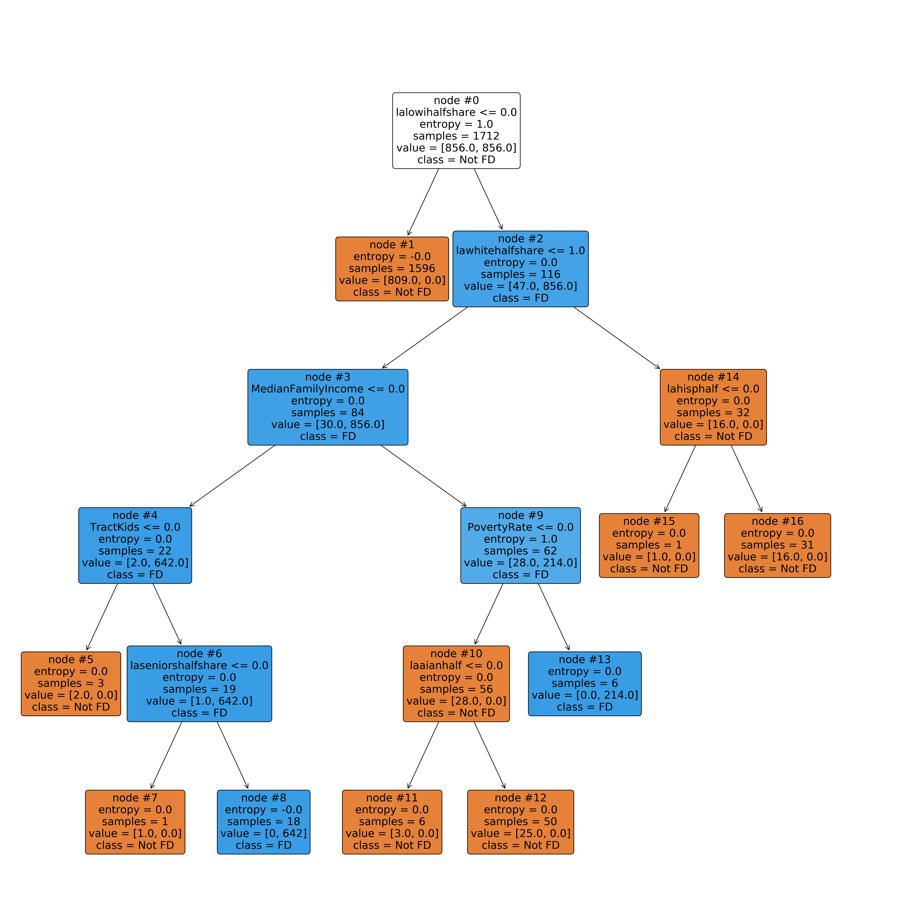

# NYC Food Desert Predictor
## Flatiron Capstone Project by Justin Morgan Williams
### January 2021

## Overview

Using low-income/low-access Census Tract's (CT's) greater then 1/2 a mile from supermarkets as a proxy, this study will predict food deserts in NYC's 5 boroughs. Food deserts are geographic areas where constituents have limited access to fresh, healthy and affordable foods. Typically, low-income populations face greater barriers in accessing healthy and affordable retailers, which can lead to food insecurity and higher disease rates. Crisis such as the COVID-19 pandemic can exacerbate these issues. A key finding in September 2020 report entitled [New York Food 20/20](https://static1.squarespace.com/static/572d0fcc2b8dde9e10ab59d4/t/5f7b27b9e0c3e05f19c5442f/1601906624464/ny2020-finalv2.pdf) was, despite the public's increased food standards and awakening to the threats of diet-related diseases, the pandemic bought forth longstanding tensions between the City's actions to ensure NYC residents have both _enough_, and the _right_ foods to eat. Therefore, emphasizing the implications for those living within food desert's and the importance of addressing access limitations to fresh, healthy and affordable foods. 

The data utilized comes from a [United States Department of Agriculture (USDA) & Economic Research Service (ERS)](https://www.ers.usda.gov/data-products/food-access-research-atlas/) 2017 study, identifying food deserts nationally at the CT level. Methods applied include sub-setting NYC 5 boroughs, exploratory data analysis (EDA) with extensive geospatial renderings, and developing a model to predict food deserts for low-income/low-access CT's within 1/2 a mile of supermarkets. 

Results found that more vulnerable CT include **low-income, low-access tracts with increased poverty, lower median income, higher proportion of kids (0-17) and those with higher proportions of people of color (POC)**. Recommendations and next steps include looking into incentives for supermarket expansion within the affected tracts, perhaps through an already established program such as [Food Retail Expansion to Support Health (FRESH)](https://edc.nyc/program/food-retail-expansion-support-health-fresh). FRESH is a program that gives tax and zoning incentives for supermarket expansions in under-served areas. As well as exploring opportunities for local community urban agriculture initiatives with youth involvement such as [Red Hook Farms](http://www.added-value.org/).

## Business Case

Identification of food deserts at the CT level in NYC is imperative to the improvement of food policy. Improved food policy could end food insecurity and encourage afflicted populations to choose diets rich in fresh and healthy foods. This could limit diseases of modernity thus reducing the strain on the healthcare industry which would in turn make our city more resilient to crisis such as the COVID-19 pandemic. However, simply finding food deserts identified previously in a recent dataset is inadequate. In order to mitigate future food insecurity and disease rates, changes to food policy need to be implemented in advance. For example, as it takes a number of years to build new supermarkets, the FRESH initiative should be revamped to identify locations that will become food deserts. Therefore, the model implemented within this study, will be trained on the aforementioned USDA dataset, and then can be applied to predicting food deserts at the CT level for newer data. 

## Data

The data used for this project came mostly from the [USDA ERS _Food Research Atlas_](https://www.ers.usda.gov/data-products/food-access-research-atlas/go-to-the-atlas/) study. Additional 2010 CT geospatial data was obtained from [NYC OpenData](https://data.cityofnewyork.us/City-Government/2010-Census-Tracts/fxpq-c8ku) and merged with the USDA dataset to perform various geospatial visuals. 

USDA dataset included multiple _flag for food desert_ binary columns. This study was solely focused on low-access 1/2 mile from supermarkets, subsequently, many columns were dropped. The target variable was a combination of two variables

**Low-income tract** - A tract with either poverty rate of 20 percent or more, or a median family income less than 80 percent of surrounding metropolitan area median family income

**Low-access tract** - A tract with at least 500 people, or 33 percent of the population, living more than 1/2 mile from the nearest supermarket, super-center, or large grocery store.

The aforementioned inform the _target_ variable of:

**Low-income and low-access tract measured at .5 mile** (LILATracts_halfAnd10) - A low-income tract with at least 500 people, or 33 percent of the population, living more than 1/2 mile from the nearest supermarket, super-center, or large grocery store.

Specific columns and their respective definitions are linked <a href="https://github.com/justinm0rgan/nyc-food-desert-predictor/blob/main/images/DATADICT.md" target="_blank">here</a>

## Methodology

After substantial data cleaning and merging with 2010 CT geospatial shapefiles, basic EDA was employed. Boxplots showed many numeric features were riddled with outliers, however the decision was made to leave them be, as outliers are integral to this study. For instance, many columns dealing with low-access demographic subsets of the population are by definition outliers, to impute them as otherwise would simply erase their significance.  Geospatial analysis was used extensively to geographically visualize important features and their inherent relationships. Features were engineered that allowed better visual analysis of dataset, however complex interactions were avoided in lieu of model interpretability. 

After EDA, the cleaned dataset was bought into the modeling notebook, and all boolean classification columns that could lead to data leakage were dropped. Next various models were iterated on, these included: 
<br>

| Model                    | All Features | GridSearch | Recursive <br>Feature</br> Elimination |
|--------------------------|--------------|------------|-------------------------------|
| Logistic Regression      | &#x2611;     | &#x2611;   | &#x2611;                      |
| Decision Tree Classifier | &#x2611;     | &#x2611;   | &#x2612;                      |
| Random Forest Classifier | &#x2611;     | &#x2611;   | &#x2612;                      |
| XGBoost                  | &#x2611;     | &#x2611;   | &#x2612;                      |
<br>

The best model which had a near perfect F1 and Recall score (one False Negative, no False Positives), ended up being Decision Tree Classifier model with GridSearch. After this, predictions were geospatially visualized, and FRESH geometry was overlayed to see which CT classified as food deserts were not within its boundaries. 

## EDA Visualizations

### Binary Target 
<p align="center">

</p>
High class imbalance with:

- <b>2165</b> total CT
- <b>98.57%</b> or <b>2134</b> were not classified as food deserts
- <b>1.43%</b> or <b>31</b> were classified as food deserts 

## Geographic distribution
<p align="center">

</p>
<p align="center">

</p>

<u>Observations</u>
- No CT flagged for food desert in Manhattan
- Although most frequent in Kings and Queens counties, highest proportion in Richmond

### White per CT with Food Deserts
<p align="center">

</p>

### Black per CT with Food Deserts
<p align="center">

</p>

### Latinx per CT with Food Deserts
<p align="center">

</p>

### Asian per CT with Food Deserts
<p align="center">

</p>

<u>Observations</u>
- Most food deserts in areas with low rate of white and asian populations
- Most food deserts in areas with high rate of black population
- Some food deserts in areas with high rate of latinx population

### Median Income vs. Poverty Rate
<p align="center">

</p>

<u>Observations</u>
- Highly negatively correlated features suggesting more significant weights in modeling

## Results
Our final model is Decision Tree Classifier (DTC) with GridSearch. 

#### Decision Tree Classifer Plot
<p align="center">

</p>

Final model results indicate most efficient feature splitting on:

1) `lalowihalfshare` - Share of tract population that are low income individuals beyond 1/2 mile from supermarket

2) `lawhitehalfshare` - Share of tract population that are white beyond 1/2 mile from supermarkets

3) `MedianFamilyIncome` - Tract median family income

4) `TractKids` - Total count of children age 0-17 in tract

5) `laseniorshalfshare` - Share of tract population that are seniors beyond 1/2 mile from supermarkets

6) `PovertyRate` - Share of the tract population living with income at or below the Federal poverty thresholds for family size

7) `laaianhalf` - American Indian or Alaska Native population count beyond 1/2 mile from supermarket

8) `lahisphalf` - Hispanic or Latino ethnicity population count beyond 1/2 mile from supermarket

This highlights most important indicator of food deserts are share of tract that are low-access/low-income. Secondarily are share of tract that are white (or not white), followed by median income, count of kids, senior share, poverty rate, and finally by share of tract low-access American Indian/Alaskan Native or latinx.

This tells us that although that low-access and low-income are the primary indicators, share of white population within a given tract has a direct relation to whether or not it was classified as a food desert. That coupled with median income and poverty rate, count of kids/share of seniors and a few other demographic indicators, gives us almost a perfect result. 

<u>**Decision Tree Classifier Metrics**</u>

**F1** = .92

**Recall** = .85

**Decision Tree Classifer Confusion Matrix**
<p align="center">

</p>

In this instance `F1` was chosen as the primary metric with `Recall` secondary. This is because with the goal of expanded FRESH coverage to areas identified as food deserts, or introducing urban agriculture initiatives, limitation of False Positives was of the utmost importance. We would not want to identify an area as a food desert, and start shifting resources to implement zoning or tax incentives only to find it is not in need of supermarket expansion. Therefore, utilizing `F1` as a primary metric to achieve a more harmonic mean was desirable. However, limiting False Negatives (not identifying a food desert when it is) was important as well. Therefore, `Recall` was chosen as a secondary metric to limit False Negatives.

### Geospatial depictions of Final Model Predictions
<p align="center">

</p>

Model predicted 30 (out of 31) values as True and 2134 as False.
- True Positive - 30 Olive CT are those that were predicted corectly 
- False Positive - 0 yellow CT that were incorrectly predicted as positive
- Food Desert - 31 black CT that are positive labels from the original dataset
- Not Food Desert - purple CT that are negative labels from the original dataset
- Missing Values - lightgrey CT that do not have values i.e. parks, cemetaries etc...

The only food desert incorrectly predicted was in the South Bronx, you can see that it is a black, as opposed to olive color. This is then the lone False Negative generated by the model.

###  Geospatial depictions of Final Model Predictions with FRESH geometry overlay
<p align="center">

</p>

The above map shows us that most food deserts lay within FRESH boundaries, however there are some that do not, most prominently in Queens and Staten Island. That said, these food deserts classifications are based on a study conducted in 2017, and the FRESH data is recent, therefore this model would need to be run on newer data, then compared and contrasted with FRESH boundaries prior to invoking any policy changes. 

## Conclusions/Next Steps
Low-access and low-income are the primary drivers of food deserts, therefore perpetuating the inequities present in our economic system, racial demographics have a great influence as well. Meaning areas with higher proportions of white residents are less likely to be a food desert. Wicked issues such as _income_ and _poverty_  are outside the scope of this study, yet are also major drivers. Additionally, higher proportions of non-earners, i.e. kids (0-17)and seniors (65+), indicate more susceptibility to becoming a food desert. Expansion of supermarkets encouraged through adjusted FRESH boundaries, will help increase access to fresh, healthy and affordable foods. This will address the top driver of food deserts, however the other drivers can only be mitigated through addressing the systemic inequities embedded within our system. 

Next steps include running modeling predictions on newer data, and contrasting with [Food Retail Expansion to Support Health (FRESH)](https://edc.nyc/program/food-retail-expansion-support-health-fresh) boundaries to identify CT in need. As well as, exploring opportunities for local community urban agriculture by looking at city owned sites that are suitable for urban agriculture within CT identified as food deserts. Using [Red Hook Farms](http://www.added-value.org/) as a model, these sites could be transformed into thriving community centers that help increase access to fresh, healthy and affordable foods. 

## For More Information
Please review full analysis in [EDA notebook](./notebooks/eda.ipynb), [Modeling notebook](./notebooks/modeling.ipynb) and [presentation](./slide_deck.pdf).

For any additional questions, please contact **Justin Williams - justinmorganwilliams@newschool.edu**

## Repository Structure

```
├── README.md                                    <- Top-level README for reviewers of this project
├── notebooks
│   ├── data_cleaning.ipynb                          <- Data cleaning in Jupyter notebook
│   ├── eda.ipynb                                    <- Exploratory data analysis in Jupyter notebook
│   ├── modeling.ipynb                               <- Modeling analysis in Jupyter notebook
├── slide_deck.pdf                               <- PDF version of project presentation
├── src                                          <- Functions imported into Jupyter Notebooks
└── images                                       <- Generated from code
```

